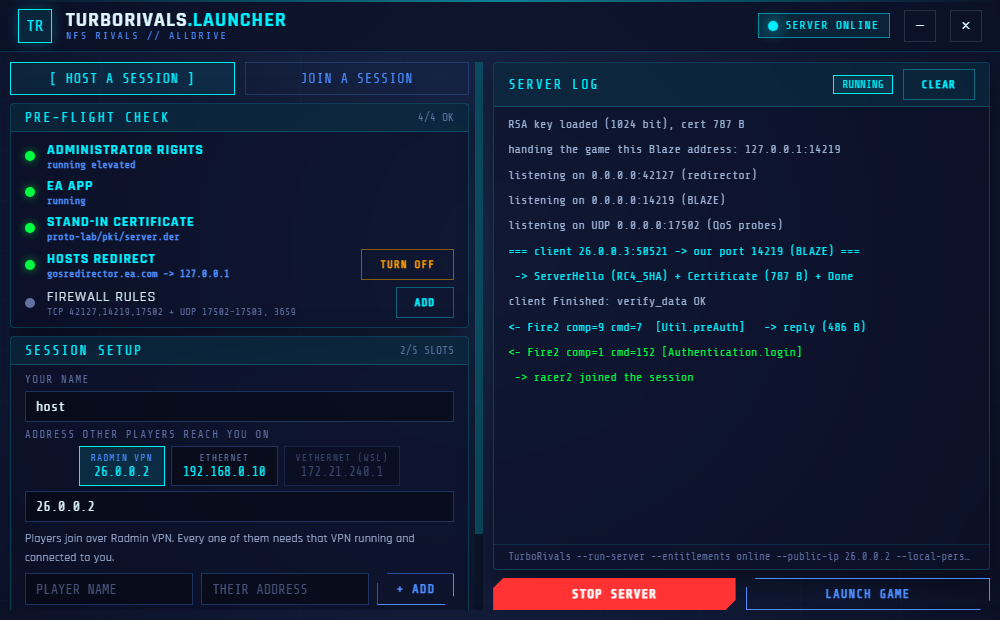

# TurboRivals

Private multiplayer servers for **Need for Speed Rivals**.

EA shut the game's online services down on 7 October 2025. Rivals still runs offline, but
AllDrive — the shared open world for up to six players — died with the servers. This project
puts a replacement server in its place.

**Status: AllDrive works.** Two players, one shared session, driving together, progress saved —
over a LAN and over a VPN.

This project ships no game files, assets or executables, and circumvents no copy protection.
Every player uses their own legally purchased copy; we only provide a server that stands in for
a service the publisher switched off. [MIT licensed](LICENSE).

## What you need

- **Need for Speed Rivals** (Steam or EA App) — each player needs their own copy
- **EA App** running in the background — the game is launched through it, not through Steam
- **Edge WebView2 Runtime** for the launcher — built into Windows 11, a free download on older Windows 10
- **Python 3.10+** — only if you run from source; the packaged launcher needs nothing installed
- **Radmin VPN** or Hamachi if you are playing over the internet (not needed on a shared LAN)

Frida, memory dumps and `launch_direct.py` exist purely for protocol analysis. **They are not
needed to play** — launch the game normally through Steam.

## The launcher



`launcher/` is a windowed launcher that does the `hosts` entry, the firewall rules and the
player names for you, and streams the server log. It is the easy path; the console commands
below still work and remain the reference.

```powershell
venv\Scripts\pythonw.exe launcher\app.py      # pythonw = no console window
```

### Building the standalone version

No Python, no repository and no `openssl` on the target machine — for handing to the people
you play with.

```powershell
venv\Scripts\python.exe -m pip install pyinstaller pywebview cryptography
winget install JRSoftware.InnoSetup      # once, for the installer
.\build.ps1
```

Two things come out of `dist\`:

| | |
| --- | --- |
| `TurboRivals\` | 35 MB folder — a local copy; see the warning below before zipping it |
| `TurboRivalsSetup.exe` | 14 MB installer — Start Menu entry, uninstaller, no UAC prompt |

**Hand people the installer, not a zip of the folder.** Every file extracted from a
downloaded archive inherits Mark-of-the-Web, and .NET then refuses to load
`pythonnet
untime\Python.Runtime.dll`, which pywebview needs — the launcher dies with
`Failed to resolve Python.Runtime.Loader.Initialize`. Inno Setup writes the files fresh, so
an installed copy never hits this. A zip works only if the recipient unblocks it first
(`Get-ChildItem -Recurse <folder> | Unblock-File`).

The installer is per-user: it lands in `%LOCALAPPDATA%\Programs\TurboRivals` and needs no
administrator rights, because the launcher asks for them itself when it touches `hosts` or
the firewall. Uninstalling takes the `hosts` redirect down first — otherwise you would be
left with an entry that breaks the EA App and no tool to remove it. Your data in
`%LOCALAPPDATA%\TurboRivals` (config, `pki/`, captures) survives.

[TurboRivals.spec](TurboRivals.spec) and [installer/TurboRivals.iss](installer/TurboRivals.iss)
document what goes in and why.

**One folder, not one file.** A one-file build unpacks ~30 MB into `%TEMP%` on every start
and deletes it on exit; when anything still holds a file there, it reports
`Failed to remove temporary directory`, which looks like a crash but is only failed cleanup.
One folder never touches `%TEMP%` and starts instantly.

Two more things make this work, and both matter if you change the code:

- **The exe runs the server by re-invoking itself.** Frozen, `sys.executable` is the launcher,
  not a Python interpreter, so `commands.build_command` emits `TurboRivals.exe --run-server …`
  and `app.py` dispatches on that flag before it imports the GUI. `--make-cert` and
  `--hosts-off` do the same for the certificate and for the uninstaller, which is also how the
  packaged build gets tested without driving the UI. The server mode switches its output to
  line buffering, or the log panel would sit empty while a session runs.
- **Nothing needs `openssl` any more.** `make_stub_cert.py` builds the certificate with
  `cryptography`, and `tls_terminator.load_rsa_priv` reads the key with its own DER parser
  instead of shelling out to `openssl rsa -text` on every start.

Everything the program writes goes to `%LOCALAPPDATA%\TurboRivals`, never next to the exe,
so an installed copy and the portable one share the same config, certificate and progress.

## How to play

### The machine running the server (host)

```powershell
# 1. point the EA backend at yourself (run PowerShell as Administrator)
python tools/hosts_switch.py on

# 2. generate the stand-in certificate (once)
python proto-lab/make_stub_cert.py

# 3. start the server; --public-ip is YOUR address as the other players see it
python -u proto-lab/tls_terminator.py --public-ip <YOUR_ADDRESS> --entitlements online
```

`--public-ip` must name the adapter the other players reach you through. On Radmin that is your
Radmin address (`26.x.x.x`), **not** your LAN address. Get this wrong and the server hands
players an address they cannot see, which is the single most common way to break a session.
Without the flag the server guesses from the default route.

Firewall rules (once, as Administrator):

```powershell
netsh advfirewall firewall add rule name="TurboRivals" dir=in action=allow protocol=TCP localport=42127,14219,17502
netsh advfirewall firewall add rule name="TurboRivals QoS" dir=in action=allow protocol=UDP localport=17502-17503
netsh advfirewall firewall add rule name="NFS Rivals P2P" dir=in action=allow protocol=UDP localport=3659
```

### Everyone else

The only step is a `hosts` entry pointing at the server (PowerShell as Administrator):

```powershell
$h = "$env:SystemRoot\System32\drivers\etc\hosts"
# drop any older entry first - with two lines the first one wins, not the newest
(Get-Content $h) | Where-Object { $_ -notmatch 'gosredirector\.ea\.com' } | Set-Content $h -Encoding ASCII
Add-Content -Path $h -Value "<SERVER_ADDRESS>`tgosredirector.ea.com" -Encoding ASCII
ipconfig /flushdns
```

Plus one rule for player-to-player traffic — the game connects players directly, not through
the server:

```powershell
netsh advfirewall firewall add rule name="NFS Rivals P2P" dir=in action=allow protocol=UDP localport=3659
```

Remove the `hosts` line when you are done, otherwise the game will keep looking for that server
on every launch.

### In game

The first player to pick "Search for session" becomes the host; everyone else joins the same
way. There is no session browser — the server drops joining players into the existing public
game by itself.

### Player names

The server has no way to learn your EA name: at login the client sends nothing but an opaque
Origin token, which only EA's own service could resolve. So every player names themselves in
their own launcher, in *YOUR NAME*. The field starts out with your EA nickname when the EA App
has it. A joining player's launcher sends the name to the host on *REDIRECT AND PLAY*, and the
server keeps it with that player's career save id, so it stays the same over LAN or a VPN and
across restarts.

Next to the name is your picture. Click the square and pick any photo. The launcher shrinks it to
a small PNG and sends it to the host's server, and every launcher in the session shows who is
logged in under *ONLINE NOW*, with pictures. The host keeps them in `avatars\` next to
`players.json`. The game shows the picture too. It asks the server for each player's profile
picture (ByteVault `GET .../categories/Pictures/records/<id>`), and the server answers with the
launcher's 256 px JPEG as raw bytes (`Content-Type: image/jpeg`). Confirmed on 30.09 with the
player's own picture. A picture set before 1.0.6 has no JPEG copy, so pick it once more.

The host's player list (`--player <address>=<name>`) is only for someone joining without the
launcher, and it goes by address, so it has to be the address the host actually sees them
connect from. From the console:

```
--local-persona "YourName"        name of the player at the server (stored permanently)
--player 26.0.0.2=FriendName      name for an address, for a player without the launcher
```

### Career saves

Rivals keeps your career on your own PC, in
`Documents\Ghost Games\Need for Speed(TM) Rivals\settings\<id>.sav`. The game loads your
account's own save from the EA era, but it writes to the file named after the id the server
gives it at login. If the two ids differ, every change (a new paint job, an unlocked car) goes
to a file the game never reads, and it is gone after a restart.

So the server logs every player in under the id of the save their game loads. That id is the
persona id the EA App gives the game on start. The launcher takes it from the EA App's log
(`%LOCALAPPDATA%\Electronic Arts\EA Desktop\Logs\EADesktopVerbose.log`) when the id is written
there in full. The EA App usually masks it as `####`, so the launcher falls back to the save
files: a save ending in the same five digits as the EA account, or else the only EA save on the
PC. If none of that works, the id is only a guess and the launcher says so.

- **the host** — found automatically through the EA App on the server's machine
  (`--local-id <id>` overrides it);
- **everyone else** — their launcher sends it to the host on *REDIRECT AND PLAY* (the client
  panel shows it as *YOUR CAREER SAVE*). Without the launcher, the host passes
  `--player-id <their address>=<id>`.

The server checks each id against the login token, so nobody can load someone else's save.
The launcher backs the save folder up once a day before a session, to
`%LOCALAPPDATA%\TurboRivals\save-backups` (last 5 kept). To see which id this PC would use,
run `python proto-lab/ea_identity.py`.

## What works

- login, session setup, client configuration, QoS
- public games and matchmaking (find-or-create)
- a shared AllDrive session for up to six players, with direct connections between them.
  Sessions of 3 to 6 players have been tested.
- host migration: when the host leaves, another player takes over and the session goes on
- progress saved from GameReporting reports (`~/TurboRivals/data`), and career progress that
  survives a game restart (see *Career saves*)
- speed walls served from saved results
- player names and profile pictures, in the launcher and in the game

## Known issues that are not bugs

Two warnings come up on a fresh machine and neither means anything is wrong:

- **"Windows protected your PC" (SmartScreen).** The build is not code-signed, so Windows
  has no reputation for it. Choose *More info* -> *Run anyway*.
- **The launcher fails with `Failed to resolve Python.Runtime.Loader.Initialize`.** That
  happens when the program was run out of a folder extracted from a downloaded archive:
  those files carry Mark-of-the-Web and .NET refuses to load them. Install with
  `TurboRivalsSetup.exe` instead, or unblock the folder first
  (`Get-ChildItem -Recurse <folder> | Unblock-File`).

One more that looks like a network problem and is not: **a joining player's game says it cannot
connect and the host's log shows nothing from that machine.** Check `hosts` on the joining machine
for a second `gosredirector.ea.com` line, one written by hand or by an older setup:

```powershell
Select-String gosredirector "$env:SystemRoot\System32\drivers\etc\hosts"
```

Windows returns the first matching line, so a stale `127.0.0.1` above the launcher's block sends
the game back to its own machine. The launcher flags such a line on the HOSTS row and removes it
on *TURN ON* and *REDIRECT AND PLAY*.

## Reporting a problem

[Open an issue](https://github.com/Turbotoster7/TurboRivals/issues/new/choose). The form asks
for the launcher version, which side hit the problem, how the players are connected, and the
`PRE-FLIGHT CHECK` panel — a screenshot of the window covers most of that at once.

What helps most is the **server log**, in particular the lines naming a component and a
command (`Fire2 comp=… cmd=…`): they say exactly how far the client got. A session that
stops after `Util.preAuth` without an `Authentication.login` almost always means the EA App
was not running on that machine.

Read the section above first — the three most common reports are not bugs.

## What is missing

- **internet play without a VPN** — the game connects players directly and EA's relay is gone
- a few RPCs still answered with an empty acknowledgement: `UserSessions.lookupUsers`,
  `NFS.getSpecialGuestInfo`, `getInGameRecommendations`, `getAutologPlaylist`

## Repository layout

```
launcher/     the windowed launcher (pywebview UI + the system plumbing)
tools/       recon tooling (binary analysis, hosts switcher)
proto-lab/   the server and the protocol decoders
docs/        protocol notes, decision log, raw recon output
```

Protocol details: [docs/protocol.md](docs/protocol.md).
Work log, including the reasoning and the dead ends: [docs/decisions.md](docs/decisions.md).

Both documents are currently written in Polish.

## Recon tooling

```bash
python tools/dump_strings.py "<path>/NFS14.exe" --all --tags   # strings from the binary
python tools/extract_tdf_meta.py "<path>/NFS14.exe"            # TDF tag <-> field pairs
python tools/pe_probe.py "<path>/NFS14.exe" info               # PE probe
python proto-lab/tcp_tap.py -p 42127                           # passive listener
python proto-lab/frida_run.py                                  # diagnostic hook
```

## Roadmap

| phase | scope | state |
| --- | --- | --- |
| 0 | binary and endpoint recon | done |
| 1 | working out the protocol | done |
| 2 | prototype server, first shared session | done |
| 3 | launcher: hosts, firewall and names without a console | done |
| 4 | host migration, sessions for 3-6 players | done |
| 5 | internet play without a VPN (NAT traversal) | |
